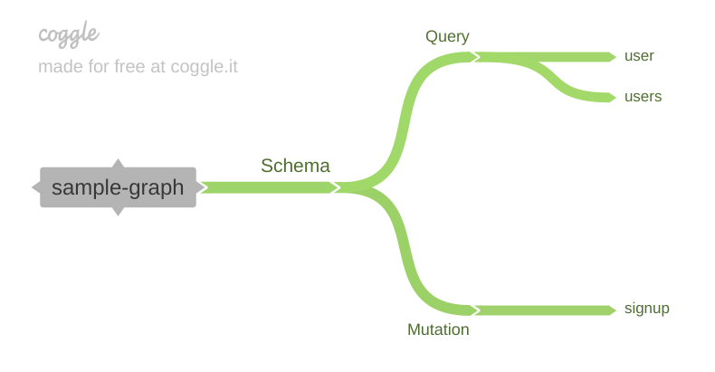

# sample-graph

An sample Golang-based GraphQL API

## Concept



## Running

```shell
go run main.go
```

## About

This service was created only to help us practice and shared the knowledge via an arcticle we published on [Medium](https://medium.com/artemis-tech/getting-started-with-graphql-golang-42476beadf7b)